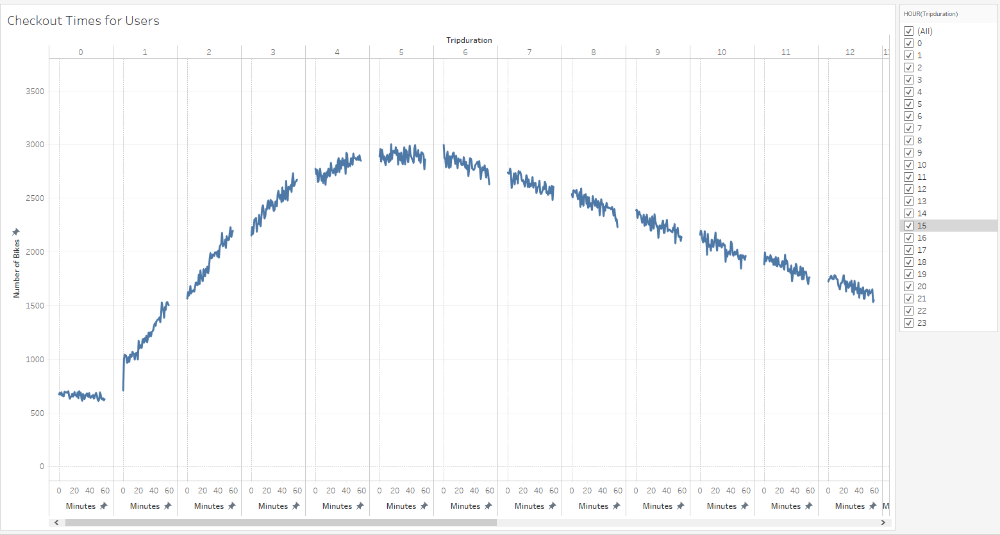
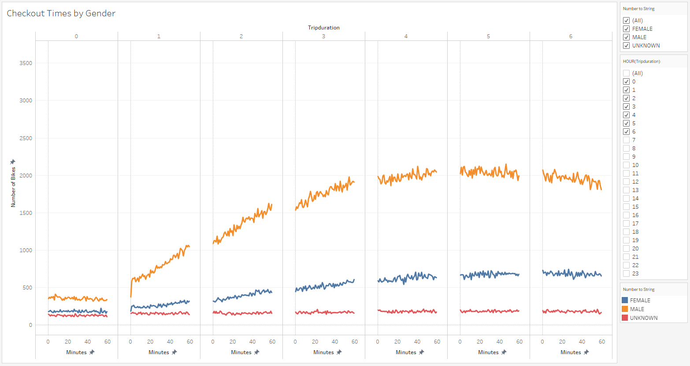
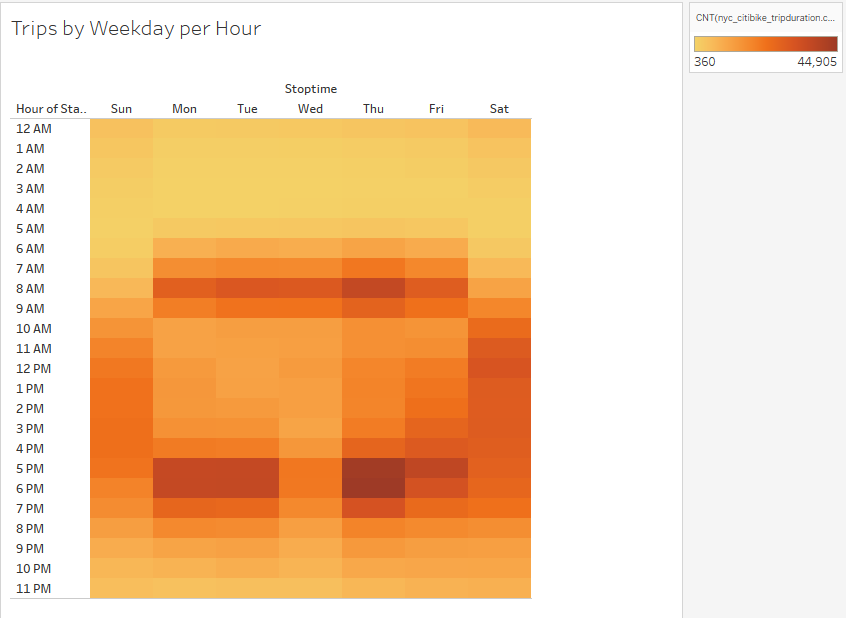
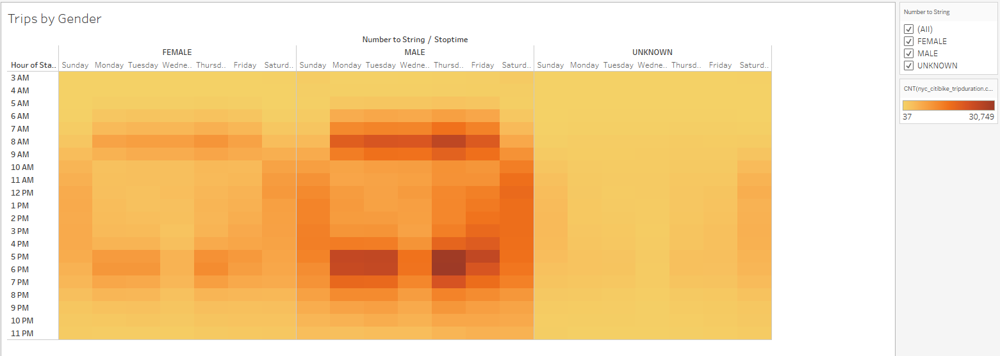
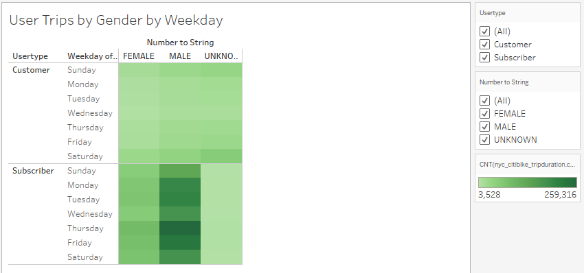
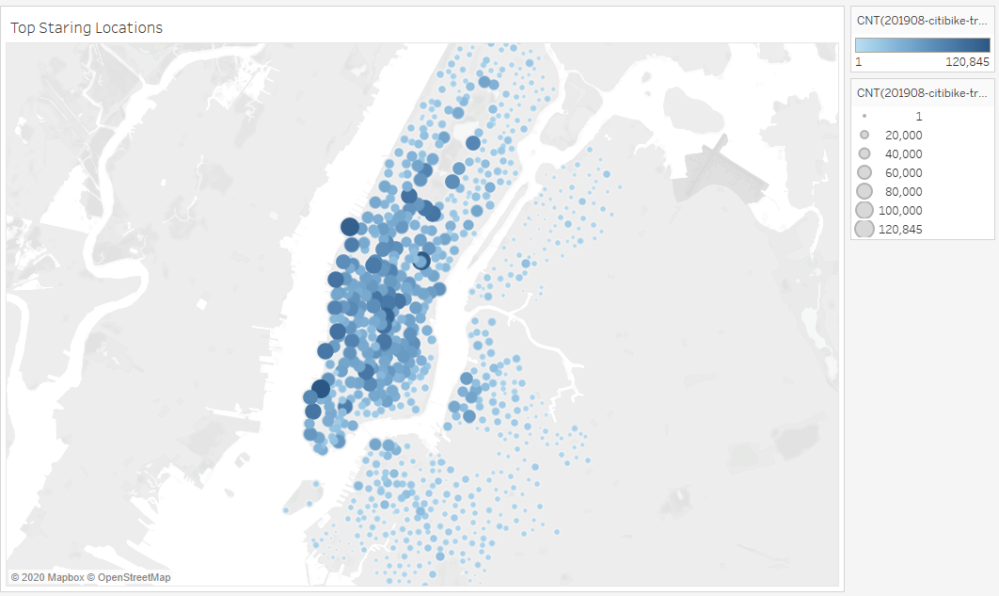
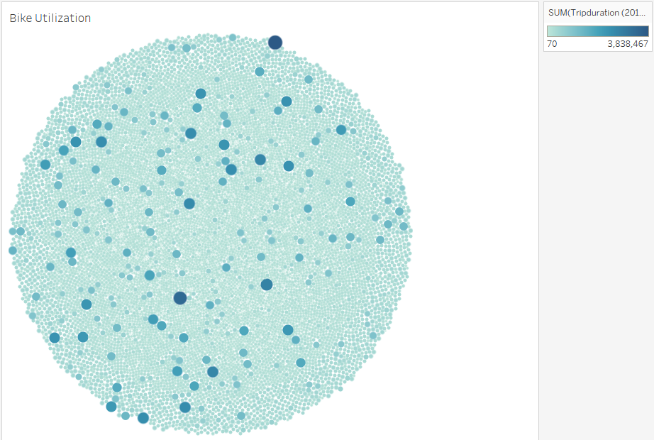

# bikesharing Startup - Des Moines
an analysis to explore Citi bike-share data from New York city to explore possibilites and options to implement and initiate a bike-sharing start up for Des Moines.

## Purpose:
- A proposal to pitch to potential investors regarding the possibilty to start a bike-sharing start-up.
- An analysis to potential review the bike-trips by the week and hour to make the proposal even stronger and quantifiable. 
- The data we are presenting is from the month of August, where the weather is great for riding a bike.

## Resources
- VS code v1.51.1
- [Citibike data](https://www.citibikenyc.com/system-data)
- [August 2019 data](https://s3.amazonaws.com/tripdata/index.html)
- Tableau Desktop v2020.3.3 (20203.20.1110.1623) 64 Bit.

## Link to Proposal 
**[Viz Link](https://public.tableau.com/profile/noel4218#!/vizhome/Tableau-BiikeSharing/NYCStory)**

## Results
## SUMMARY:
- Key observations that can be put forward to our proposal and pitch would begin with 
    - Total number of rides in the month of August is about 2.3 Million.
    - Where 80% of its useage is from subscribers with a plan.
    - There is an approximate 1:2 ratio for the female to male users
    - Most of the users are concentrated around central Manhatten (tourists are probably bringing in the bike trafic.)
    - Bike useage by Id is spread expect for a few bikes with extensive useage, probally a subscribers favorite.

Additional Analysis on Bike Useage-
- Checkout Times for Users show a prominent increase in useage based on trip duration during early hours of the day 4am to 6am. With this we can conclude that many users use Citibikes for their morning commutes or an early start to their day exercising. averaging about 2500 citibike users.

- The same spike is noticed when classifying the checkout times for bikes on the basis of use by gender.
- It is also evident that there are more male users to female users. But the peak useage is also noticed in the morning commute.

- We notice a trend in weekdays where usage is more from 6-9am and 5-7pm confirming our assumption of most subscribers use Citibikes for their dail commute.

- Through out the week we notice male users are more in number as well as with subscription packages.

- Customer users or non subscribers are evenly spread across the week (confirming our idea that these are mostly tourists moving around the city).

- Also noticed is the starting and end points of trips are densly populated around the Manhattan area which is a tourist location, and an important note to consider in Des Moines city center.

- Since concentration of bike usage is in the Manhattan area, the below visualization carries information regarding the bikeID that is used the most.

## Suggestions
1. If information on actual data of bike repairs and its costs, we could link bikeID to repairs and predict the average cost. just a visualization for an investment perspective.
2. A random survey to understand the market for potential users in Des Moines can be helpful.
3. Key areas around Des Moines to help select setup locations where tourist traffic or work commute(industries/ companies/ financial district) a visual plot to plan trip durations (convinience to customers or subscribers).

## Link to Proposal 
**[Viz Link](https://public.tableau.com/profile/noel4218#!/vizhome/Tableau-BiikeSharing/NYCStory)**